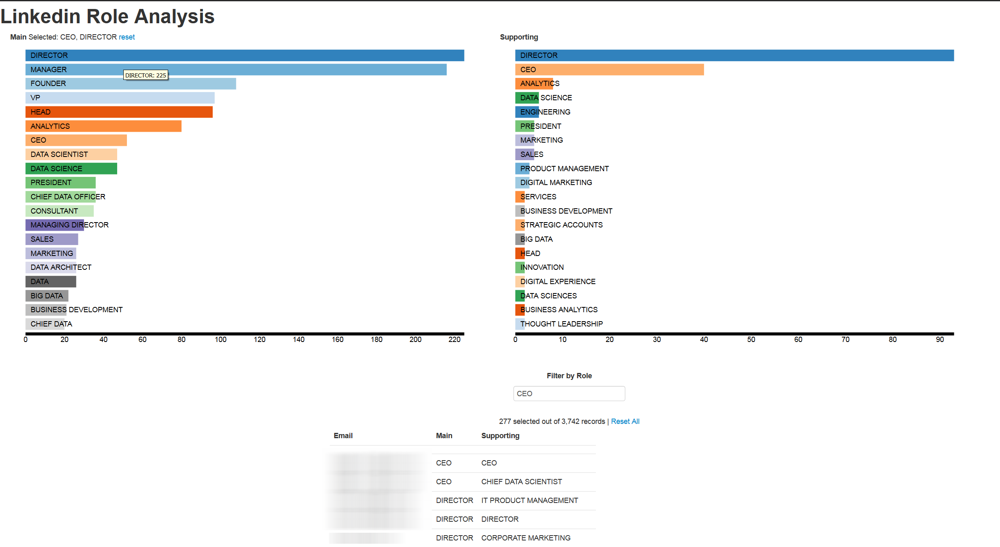

# linkedin-personal-data-analytic

You can download your personal data from the following link. This is lot of that that we can use for data analytics.
[Linkedin Personal data download](https://www.linkedin.com/psettings/member-data).


I am currently workiong on "Connections.csv" files which contains information about the linkedin connections.

```
First Name
Last Name
Address
Email Address
Company
Position
Connected On
Websites
Instant Messengers
```

### Following is a viz for Time of connection in a bar chart
the challange was how to highlight the different time of the day


### Following is a viz for Roles of your connections
after processing, open for linkedin_RoleAnalysis.html file in dc folder

